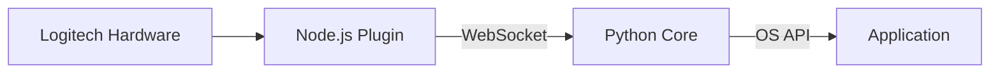

# CORTEX: The Zero-Latency Interface for Logitech MX

## Vision & Philosophy

CORTEX introduces **"Speculative Execution"** (Action  Show  Refine) to replace "Wait Latency." It prioritizes immediate user feedback over system processing, adhering to the **Falling Edge Law**: providing visual feedback in .

### The Problem: The AI Wait-State

In the current era of AI tools, productivity faces a new form of friction: latency. Users must copy text, open separate tools, wait for AI responses, and paste back. This process shatters the cognitive "flow" state.

### The Solution: Neuro-Paste

CORTEX is a hybrid architecture (Logitech Plugin + Local Python Core) that eliminates cognitive load through the Falling Edge Law. It assumes user intent and executes immediately, refining the output in the background as the user maintains contact with the hardware.

---

## Architecture

### High-Level Diagram



### Components

* **Node.js Plugin**: A lightweight client based on the **Logitech Actions SDK**. It handles input events (`keyDown`, `keyUp`, `mouseMove`) and streams signals via WebSocket.
* **Python Backend**: A **FastAPI/Uvicorn** server running on `localhost:8989`. It manages state, keystroke injection, and clipboard manipulation using native OS APIs.

---

## Installation

1. **Clone the repository**: `git clone <repo-url>`
2. **Install dependencies**: `pip install -r backend/requirements.txt`
3. **Compile the executable**: `pyinstaller --onefile --noconsole backend/main.py` (this generates `dist/backend.exe`).

---


## Requisitos del sistema

- **Sistema operativo**: Windows 10 (21H2 o superior) o Windows 11.
- **Python**: 3.10+.
- **Permisos recomendados**:
  - Ejecutar `backend.exe` con el mismo nivel de privilegios que la app objetivo (si una app corre como administrador, el backend también).
  - Permitir acceso local al proceso para WebSocket en firewall/endpoint protection.
- **Dependencias de entrada/automatización**:
  - `pywin32` (incluyendo `win32gui`) para APIs nativas de ventana.
  - `pynput` para simulación de teclado global.
- **Conflictos comunes (antivirus/UAC)**:
  - Algunos antivirus/EDR bloquean inyección de teclado o acceso al portapapeles; añadir exclusión para `backend.exe` puede ser necesario.
  - UAC puede impedir eventos de teclado entre procesos con distinto nivel de integridad (normal vs admin).
  - Si `pywin32` falla tras instalar, ejecutar `python -m pywin32_postinstall -install` en consola con privilegios.

## Usage

1. Run `backend.exe` (runs as a background service).
2. Connect the Logitech plugin and map a device button to **"CORTEX Paste"**.
3. **UX Flow**:
* **keyDown**: Immediate Paste (equivalent to Ctrl+V).
* **Hold (>300ms)**: Refines the pasted text (e.g., case conversion, formatting cleanup).
* **mouseMove during hold**: Aborts the refinement to prevent unwanted data modification.


---

## Configuration in Logitech Options+

1. **Install Logitech Options+**: Download and install from the official Logitech site if not already present.
2. **Copy the Plugin**: Copy the entire `plugin/` folder to the Logitech Options+ plugins directory (typically `C:\Users\[User]\AppData\Local\Logitech\Logitech Options\Plugins\`).
3. **Restart Logitech Options+**: Close and reopen the application to detect the new plugin.
4. **Configure the Device**:
   * Open Logitech Options+ and select your Logitech MX device.
   * Navigate to the "Actions" tab and click "Add Action".
   * Select "Custom Action" and choose "Run Plugin".
   * From the plugin list, select **"CORTEX Neuro-Paste"**.
   * Assign the action to a programmable button (e.g., the thumb button or Easy-Switch).
   * In the plugin settings, ensure the WebSocket URL is set to `ws://localhost:8989/cortex` (default).
5. **Verify Connection**: Launch the backend (`backend.exe`) and check the console for "WebSocket connection established". The plugin will attempt to connect automatically upon device button press.

> **Note**: Ensure the backend is running before using the plugin. The plugin acts as a trigger, sending events via WebSocket to the backend. If connection fails, verify firewall settings allow localhost connections.

---


## Runtime Configuration

### Backend (`backend/config.json`)

The backend reads runtime configuration from `backend/config.json` at startup.

```json
{
  "ws_host": "localhost",
  "ws_port": 8989,
  "transform_rules": ["uppercase"],
  "log_level": "INFO",
  "log_file": "backend/backend.log"
}
```

- `ws_host`: Uvicorn bind host.
- `ws_port`: Uvicorn bind port.
- `transform_rules`: Ordered rules applied by `process_text`.
- `log_level`: Nivel de logs (`DEBUG`, `INFO`, `WARNING`, `ERROR`, `CRITICAL`).
- `log_file`: Ruta del archivo sink para persistencia de logs estructurados.

### Plugin (`plugin/config.json`)

The plugin reads local settings from `plugin/config.json`.

```json
{
  "ws_url": "ws://localhost:8989/cortex",
  "reconnect_ms": 1000,
  "hold_threshold_ms": 300,
  "mouse_abort_debounce_ms": 100
}
```

- `ws_url`: Backend WebSocket endpoint.
- `reconnect_ms`: Reconnect delay when socket closes.
- `hold_threshold_ms`: Hold duration before triggering `replace` on key up.
- `mouse_abort_debounce_ms`: Debounce for movement-triggered abort.


## Operación y soporte

### Códigos de error WS (troubleshooting rápido)

| Código | Causa probable | Acción |
|---|---|---|
| `INVALID_JSON` | Payload JSON inválido | Validar serialización del plugin. |
| `NO_ACTIVE_CYCLE` | Se invocó `replace/abort` sin `paste_cycle` | Ejecutar `paste_cycle` antes. |
| `CYCLE_MISMATCH` | `cycle_id` desincronizado | Re-sincronizar ciclo en cliente. |
| `WINDOW_MISMATCH` | Cambio de ventana activa | Mantener foco o reiniciar ciclo. |
| `ABORTED` | Abort activado por movimiento/input | Reintentar sin movimiento durante hold. |
| `UNKNOWN_ACTION` | Acción WS no soportada | Usar `paste_cycle`, `replace`, `abort`. |
| `PROCESSING_FAILED` | Fallo en clipboard/procesamiento | Revisar permisos y `transform_rules`. |

### Playbook soporte (síntoma → causa probable → acción)

| Síntoma | Causa probable | Acción |
|---|---|---|
| Plugin no conecta | Backend apagado / puerto incorrecto | Ejecutar `python backend/health_check.py` y revisar `ws_host/ws_port`. |
| Conecta pero no pega | Foco en ventana no editable | Cambiar foco y repetir. |
| `replace` falla con `WINDOW_MISMATCH` | Cambio de foco entre pasos | Mantener foco fijo durante hold. |
| `replace` falla con `ABORTED` | Señal abort durante hold | Reducir movimiento del mouse / ajustar debounce en plugin. |

### Health check backend

Script incluido: `python backend/health_check.py --host localhost --port 8989`

Valida:
1. Puerto TCP.
2. Endpoint WebSocket `/cortex`.
3. Handshake WebSocket (`HTTP 101`).

## Technical Script for Video Demo: Speculative Execution (Max 2 min)

### Introduction (0:00 - 0:15)
"Welcome to CORTEX: Zero-Latency Interface for Logitech MX. Demonstrating 'Speculative Execution' – anticipate, show, refine."

### Architecture Overview (0:15 - 0:45)
*Display Mermaid diagram.*
"CORTEX integrates Logitech Actions SDK with local Python backend via WebSocket. Plugin triggers events; backend executes OS-level actions."

### Speculative Execution Flow (0:45 - 1:30)
* **Immediate Trigger (keyDown)**: Button press sends 'paste_cycle'. Backend fires Ctrl+V in <5ms – user sees paste instantly.
* **Async Refinement**: Background processing converts text (e.g., uppercase) in <10ms, no UI block.
* **Conditional Replace (Hold)**: Hold >300ms sends 'replace'; backend applies refined text via Select All + Paste.
* **Safety Abort**: Mouse move cancels refinement, preventing data loss.

### Latency Compliance (1:30 - 1:45)
"Total loop <16ms, matching hardware polling rate. Eliminates cognitive wait-state."

### Live Demo (1:45 - 2:00)
* Run backend.exe.
* Configure button in Logitech Options+.
* Copy text, press button: instant paste.
* Hold: text refines.
* Move mouse: aborts safely.

"Neuro-ergonomics redefined. Thank you."

---


## Quality & Release Management

- CI workflow with separate jobs for lint, unit tests, and WebSocket protocol checks: `.github/workflows/ci.yml`.
- QA strategy, smoke test classification, compatibility matrix, and release gates: `docs/quality_strategy.md`.
- Versioned benchmark reports per release: `reports/`.

## Tech Stack & Dependencies

* **Backend**: Python 3.10+, FastAPI, Uvicorn, `pyperclip`/`win32clipboard`, `pynput`.
* **Frontend**: Node.js (Logitech SDK).
* **Communication**: Local WebSocket.
* **Deployment**: Compiled via PyInstaller.

For advanced technical details, see [`docs/manifesto.md`](https://www.google.com/search?q=docs/manifesto.md).

## Roadmap

* **Context Awareness**: Formatting logic based on the active window (e.g., code snippets for IDEs vs. rich text for Word).
* **MX Ink Integration**: Supporting spatial input refinement.
* **Local LLM Support**: Privacy-first processing using on-device models.

Built for **Logitech DevStudio 2026 Hackathon**. An experiment in neuro-ergonomics.

---

Would you like me to create the content for the **manifesto.md** mentioned in the documentation?