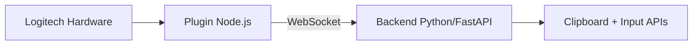

# CORTEX Neuro-Paste

Interfaz de baja latencia para dispositivos Logitech MX, basada en una arquitectura local:

- Plugin Node.js (Logitech Actions SDK)
- Backend Python/FastAPI por WebSocket en `ws://localhost:8989/cortex`

El flujo principal es: **paste inmediato** (`paste_cycle`) + **refinamiento opcional** (`replace`) con abort por movimiento (`abort`).

## Arquitectura



Componentes clave:

- `plugin/index.js`: captura `keyDown`/`keyUp`/`mouseMove` y envía acciones al backend.
- `backend/main.py`: expone endpoint WS, controla ciclo `paste_cycle`/`replace`/`abort` y estados por conexión.
- `backend/clipboard_mgr.py`: lectura/escritura de clipboard y pipeline de transformaciones.

## Quickstart técnico

### 1) Requisitos

- Python 3.10+
- Logitech Options+ con soporte de plugins/actions
- Entorno objetivo: Windows 10/11 (por dependencias de input/clipboard nativas)

### 2) Backend

```bash
pip install -r backend/requirements.txt
python backend/main.py
```

Configuración en `backend/config.json`:

- `ws_host`, `ws_port`
- `transform_rules`

### 3) Plugin

1. Copiar `plugin/` al directorio de plugins de Logitech Options+.
2. Reiniciar Logitech Options+.
3. Asignar acción **CORTEX Neuro-Paste** a un botón.
4. Verificar `plugin/config.json` (por defecto `ws://localhost:8989/cortex`).

### 4) Flujo funcional esperado

- Pulsación corta: `paste_cycle` (paste inmediato)
- Mantener pulsado: `replace` (aplica texto refinado)
- Movimiento durante hold: `abort` (cancela replace)

## Evidencia de latencia y claims

Para evitar claims no verificables, este repositorio separa **objetivos** de **evidencia**:

- Scripts de medición/auditoría:
  - `backend/test_latency.py`
  - `backend/audit_e2e.py`
- Resultado versionado más reciente:
  - `backend/latency_evidence.md`

Estado actual:

- Hay pruebas unitarias del protocolo/configuración operativas.
- Las métricas de latencia E2E requieren ejecución en entorno Windows con Logitech Options+ y hardware activo.
- Hasta que no se actualice `backend/latency_evidence.md` con una corrida real, tratar cifras de latencia como **objetivo de demo**, no SLA contractual.

## Limitaciones conocidas

- Transformación por defecto orientada a demo (regla `uppercase`), según la configuración activa.
- Dependencia fuerte del sistema operativo objetivo (Windows) para comportamiento real de input injection.
- Las pruebas automáticas del repositorio no cubren aún benchmark E2E reproducible en CI para latencia p50/p95/p99.
- Diferencias entre aplicaciones destino (Notepad/Office/IDE) pueden afectar timing de `replace`.

## Soporte y troubleshooting

### El plugin no conecta al backend

- Confirmar backend activo en `localhost:8989`.
- Revisar `plugin/config.json` (`ws_url`) y `backend/config.json` (`ws_host`/`ws_port`).
- Reiniciar Logitech Options+ después de cambios de plugin.

### `replace` falla o no se aplica

- Verificar cambio de foco de ventana entre `paste_cycle` y `replace` (hay guardas de `WINDOW_MISMATCH`).
- Revisar eventos `ack`/`status`/`error` en logs del backend.

### Validación mínima recomendada antes de demo

1. Seguir checklist de `demo_check.md`.
2. Ejecutar pruebas unitarias clave:
   - `python -m pytest -q backend/test_config_unit.py backend/test_ws_protocol_unit.py backend/test_clipboard_mgr_unit.py`
3. Revisar backlog comercial/técnico en `PLAN_CLIENTES.md`.

## Documentación relacionada

- Guía de validación de demo: [`demo_check.md`](demo_check.md)
- Plan de brechas para clientes: [`PLAN_CLIENTES.md`](PLAN_CLIENTES.md)
- Evidencia de latencia versionada: [`backend/latency_evidence.md`](backend/latency_evidence.md)

## Estado del proyecto

Proyecto en fase de validación técnica/comercial para hackathon. La narrativa de “zero-latency” debe respaldarse siempre con evidencia actualizada en scripts + resultados versionados.
