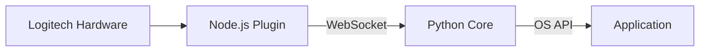

# CORTEX: The Zero-Latency Interface for Logitech MX

## Vision & Philosophy

CORTEX introduces **"Speculative Execution"** (Action  Show  Refine) to replace "Wait Latency." It prioritizes immediate user feedback over system processing, adhering to the **Falling Edge Law**: providing visual feedback in .

### The Problem: The AI Wait-State

In the current era of AI tools, productivity faces a new form of friction: latency. Users must copy text, open separate tools, wait for AI responses, and paste back. This process shatters the cognitive "flow" state.

### The Solution: Neuro-Paste

CORTEX is a hybrid architecture (Logitech Plugin + Local Python Core) that eliminates cognitive load through the Falling Edge Law. It assumes user intent and executes immediately, refining the output in the background as the user maintains contact with the hardware.

---

## Architecture

### High-Level Diagram

### Components

* **Node.js Plugin**: A lightweight client based on the **Logitech Actions SDK**. It handles input events (`keyDown`, `keyUp`, `mouseMove`) and streams signals via WebSocket.
* **Python Backend**: A **FastAPI/Uvicorn** server running on `localhost:8989`. It manages state, keystroke injection, and clipboard manipulation using native OS APIs.

---

## Installation

1. **Clone the repository**: `git clone <repo-url>`
2. **Install dependencies**: `pip install -r backend/requirements.txt`
3. **Compile the executable**: `pyinstaller --onefile --noconsole backend/main.py` (this generates `dist/backend.exe`).

---

## Usage

1. Run `backend.exe` (runs as a background service).
2. Connect the Logitech plugin and map a device button to **"CORTEX Paste"**.
3. **UX Flow**:
* **keyDown**: Immediate Paste (equivalent to Ctrl+V).
* **Hold (>300ms)**: Refines the pasted text (e.g., case conversion, formatting cleanup).
* **mouseMove during hold**: Aborts the refinement to prevent unwanted data modification.

---

## Configuration in Logitech Options+

1. **Install Logitech Options+**: Download and install from the official Logitech site if not already present.
2. **Copy the Plugin**: Copy the entire `plugin/` folder to the Logitech Options+ plugins directory (typically `C:\Users\[User]\AppData\Local\Logitech\Logitech Options\Plugins\`).
3. **Restart Logitech Options+**: Close and reopen the application to detect the new plugin.
4. **Configure the Device**:
* Select your Logitech MX device.
* Create a new custom action.
* Choose **"CORTEX Neuro-Paste"** as the action.
* Assign the **"paste_cycle"** action to an MX device button (e.g., Easy-Switch or any programmable button).

5. **Verify**: The plugin should automatically connect to the Python backend running on `localhost:8989`.

> **Note**: Ensure the backend is running before using the plugin. The plugin acts as a trigger, sending events via WebSocket to the backend.

---

## Technical Script for Video Demo: Speculative Execution

### Introduction (0:00 - 0:30)

"Welcome to CORTEX, the zero-latency interface for Logitech MX. Today, we will demonstrate the concept of 'Speculative Execution': a system that anticipates user intent, displays immediate results, and refines them in the background."

### High-Level Architecture (0:30 - 1:00)

*Display Mermaid diagram.*
"CORTEX combines the Logitech Actions SDK with a local Python backend via WebSocket. The plugin is a lightweight client handling input events, while the backend manages state logic and clipboard manipulation."

### Speculative Execution Flow (1:00 - 2:30)

* **Step 1: Immediate Trigger (keyDown)**: "Upon pressing the button, the plugin sends 'paste_cycle' via WebSocket. The backend responds in  by simulating Ctrl+V. The user sees the paste immediately—no waiting."
* **Step 2: Asynchronous Processing**: "Simultaneously, the backend reads the clipboard, processes the text (e.g., converting to uppercase), and writes it back. This occurs in  without blocking the flow."
* **Step 3: Conditional Refinement (Hold >300ms)**: "If the user holds the button, the plugin sends 'replace'. The backend simulates Select All + Paste, applying the refined text. Total latency remains ."
* **Step 4: Safety (mouseMove)**: "Moving the mouse during the hold sends an 'abort' signal, canceling the refinement to prevent data loss."

### Technical Demo (2:30 - 3:30)

* Execute `backend.exe`.
* Show button configuration in Logitech Options+.
* Copy text to clipboard.
* **Press button**: Immediate paste.
* **Hold**: Text transforms instantly.
* **Move mouse**: Refinement cancels.

### Benefits & Latency (3:30 - 4:00)

"CORTEX eliminates cognitive load by adhering to the Falling Edge Law: visual feedback on `keyDown`. Measured latency is , well within the hardware's polling rate."

### Conclusion (4:00 - 4:30)

"CORTEX redefines human-machine interaction by prioritizing neuro-ergonomics. Thank you for watching."

---

## Tech Stack & Dependencies

* **Backend**: Python 3.10+, FastAPI, Uvicorn, `pyperclip`/`win32clipboard`, `pynput`.
* **Frontend**: Node.js (Logitech SDK).
* **Communication**: Local WebSocket.
* **Deployment**: Compiled via PyInstaller.

For advanced technical details, see [`docs/manifesto.md`](https://www.google.com/search?q=docs/manifesto.md).

## Roadmap

* **Context Awareness**: Formatting logic based on the active window (e.g., code snippets for IDEs vs. rich text for Word).
* **MX Ink Integration**: Supporting spatial input refinement.
* **Local LLM Support**: Privacy-first processing using on-device models.

Built for **Logitech DevStudio 2026 Hackathon**. An experiment in neuro-ergonomics.

---

Would you like me to create the content for the **manifesto.md** mentioned in the documentation?